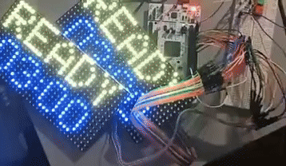

# STM32 32x16 RGB LED Matrix Countdown Timer



_A sped-up 4x demonstration showing all timer functionalities on dual displays_

## 🏆 Smash Bot Arena 2025 Project

This project was developed for **Smash Bot Arena 2025**, a competitive robotics event. The goal was to create LED matrix displays for all four sides of the competition arena to show countdown timers and match status.

**Event Link:** [RoboComp 2025](https://www.robocomp.info/)

A complete STM32-based countdown timer display for 32x16 RGB LED matrices using HUB75 interface with full button control functionality.

## 🎯 Features

- **Countdown Timer**: Counts down from 03:00 to 00:00 with MM:SS format
- **Persistent Display**: Timer stays visible as "00:00" when countdown finishes
- **Visual State Feedback**: Different colors and labels for each operational state
- **Button Controls**: Full user control with start, stop, and reset buttons
- **8-Color Support**: Full RGB color palette with easy color selection
- **Smooth Updates**: 1-second intervals with no flickering
- **Debounced Inputs**: Professional button handling with edge detection

## 🔧 Hardware

### Board

- **Microcontroller**: STM32F413ZHT6U (ARM Cortex-M4)
- **Clock Speed**: 100MHz
- **Flash Memory**: 1.5MB
- **RAM**: 320KB

### Display

- **Type**: 32×16 RGB LED Matrix Panel
- **Interface**: HUB75 (16-pin)
- **Scan Rate**: 1/8 scan multiplexing
- **Colors**: 8 colors (1-bit RGB per pixel)

## 📌 Pin Configuration

| Pin  | Function | Description             |
| ---- | -------- | ----------------------- |
| PA5  | R1       | Red data (upper half)   |
| PA6  | G1       | Green data (upper half) |
| PA7  | B1       | Blue data (upper half)  |
| PA8  | R2       | Red data (lower half)   |
| PA9  | G2       | Green data (lower half) |
| PA10 | B2       | Blue data (lower half)  |
| PB3  | A        | Row select bit 0 (LSB)  |
| PB4  | B        | Row select bit 1        |
| PB5  | C        | Row select bit 2 (MSB)  |
| PB6  | D        | Half select (always 0)  |
| PB10 | CLK      | Data clock              |
| PB11 | LAT      | Latch signal            |
| PB12 | OE       | Output enable           |
| PC6  | STOP     | Stop button (pull-up)   |
| PC8  | RESET    | Reset button (pull-up)  |
| PC9  | START    | Start button (pull-up)  |

## 🎨 Color System

The display supports 8 colors using 1-bit per RGB channel:

```cpp
// Predefined colors
#define BLACK   0x0000
#define RED     0xF800  // 1,0,0
#define GREEN   0x07E0  // 0,1,0
#define BLUE    0x001F  // 0,0,1
#define YELLOW  0xFFE0  // 1,1,0
#define MAGENTA 0xF81F  // 1,0,1
#define CYAN    0x07FF  // 0,1,1
#define WHITE   0xFFFF  // 1,1,1

// Or use color functions
matrix.setTextColor(Color333(7, 0, 0));  // Red
matrix.setTextColor(Color1bit(1, 0, 1)); // Magenta
```

## 🔤 Font Support

The display supports the following characters:

- **Letters**: A-Z (uppercase only)
- **Numbers**: 0-9
- **Punctuation**: ! ? :
- **Symbols**: space

## � Button Controls

The countdown timer features full user control with three buttons:

### Button Functions

- **START (PC9)**: Begins or resumes the countdown from current time
- **STOP (PC6)**: Freezes the countdown at current time
- **RESET (PC8)**: Resets timer to 03:00 and stops countdown

### Operation

1. **Power On**: Timer displays alternating "READY" and "ST8DY" in yellow with blue "03:00"
2. **Press START**: Display changes to green "GO!!!" with red countdown, begins counting
3. **Press STOP**: Display changes to red "STOP" with yellow countdown, freezes timer
4. **Press RESET**: Returns to alternating "READY"/"ST8DY" state with blue "03:00"
5. **Countdown End**: Timer stops and displays yellow "00:00" with red "STOP" sign

### Visual States

- **Ready State** (initial/reset): Yellow "READY"/"ST8DY" (alternating every second) + Blue "03:00"
- **Active State** (counting): Green "GO!!!" + Red countdown
- **Stopped State** (paused): Red "STOP" + Yellow countdown
- **Finished State** (countdown complete): Red "STOP" + Yellow "00:00"

### Button Implementation

- **Debounced**: Falling-edge detection prevents multiple triggers
- **Pull-up Resistors**: Internal pull-ups eliminate external components
- **Non-blocking**: Button polling doesn't interfere with display refresh

### Core Components

- **RGBmatrixPanel_STM32**: Custom LED matrix driver class
- **Countdown Logic**: Timer state management and display updates
- **HAL Integration**: STM32 HAL GPIO for direct pin control

### Display Layout

```
Row 0-7:   Green "TIMER" label (left-aligned)
Row 8-15:  Red countdown "MM:SS" (centered)
```

## 📚 Dependencies

### Based On

- **[Adafruit RGB Matrix Panel](https://github.com/adafruit/RGB-matrix-Panel)**: Arduino library for RGB LED matrices - adapted for STM32 HAL
- **Adafruit GFX**: Text rendering and graphics primitives
- **Custom HUB75 Driver**: Adapted for STM32 HAL and 32x16 panels
- **STM32 HAL Library**: GPIO and timing functions

### Development Tools

- **STM32CubeIDE**: Project creation and debugging
- **ARM GCC**: Cross-compilation toolchain
- **OpenOCD**: Programming and debugging interface

## 🚀 Getting Started

### Prerequisites

- STM32CubeIDE 1.13+
- ARM GCC toolchain
- ST-Link programmer
- 32×16 RGB LED matrix panel
- STM32F413ZHT6U board

### Building

1. Open project in STM32CubeIDE
2. Select "Debug" configuration
3. Build project (Ctrl+B)
4. Program to board

### Hardware Setup

1. Connect LED matrix to HUB75 interface pins
2. Power the matrix (5V, 2A recommended)
3. Program STM32 board
4. Countdown starts automatically on power-up

## 📊 Performance

- **Update Rate**: 1 Hz (1-second intervals)
- **Binary Size**: ~15.5KB
- **RAM Usage**: ~2KB
- **Power Consumption**: ~150mA (matrix dependent)
- **Button Response**: <10ms (debounced)

## 🔍 Troubleshooting

### Display Issues

- **No display**: Check power supply (5V, adequate current)
- **Wrong colors**: Verify RGB pin connections
- **Flickering**: Ensure stable power supply
- **Wrong positioning**: Check row select pin order
- **Solid color rows**: Check color format usage (use RED/GREEN constants)

### Timer Issues

- **Not counting**: Verify system clock configuration
- **Wrong time**: Check initial time values in countdown.cpp
- **Doesn't start**: Check if timer is paused (normal behavior)

### Button Issues

- **No response**: Verify button pin connections and pull-up configuration
- **Multiple triggers**: Check for proper debouncing (falling-edge detection)
- **Wrong function**: Verify pin assignments (PC6=Stop, PC8=Reset, PC9=Start)

## 📝 API Reference

### RGBmatrixPanel_STM32 Class

```cpp
void begin();                    // Initialize display
void updateDisplay();           // Refresh display
void fillScreen(uint16_t color); // Clear screen
void setCursor(int16_t x, int16_t y); // Set text position
void setTextColor(uint16_t color);    // Set text color
void print(const char *str);    // Print text
uint16_t Color333(uint8_t r, uint8_t g, uint8_t b); // 3-bit color
uint16_t Color1bit(uint8_t r, uint8_t g, uint8_t b); // 1-bit color
```

### Countdown Control Functions

```cpp
void countdown_init();      // Initialize timer (called automatically)
void countdown();           // Main timer logic (called in main loop)
void countdown_start();     // Start/resume countdown
void countdown_stop();      // Pause countdown
void countdown_reset();     // Reset to 03:00 and pause
```

## 📄 License

This project is open source. See individual component licenses for details.

## 🤝 Contributing

This project was developed through systematic debugging and optimization. For development history and debugging details, see `DEVELOPMENT_LOG.md`.

---

**Status**: ✅ **Complete and fully functional with button controls and Smash Bot Arena 2025 features**
